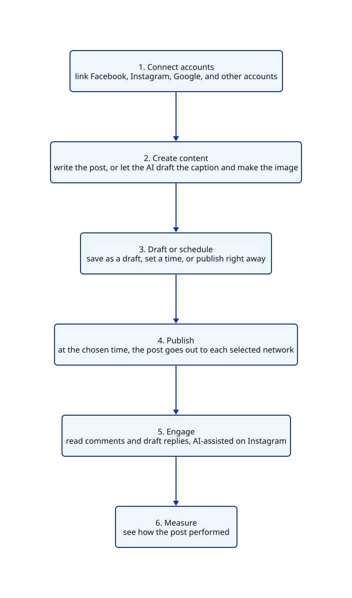
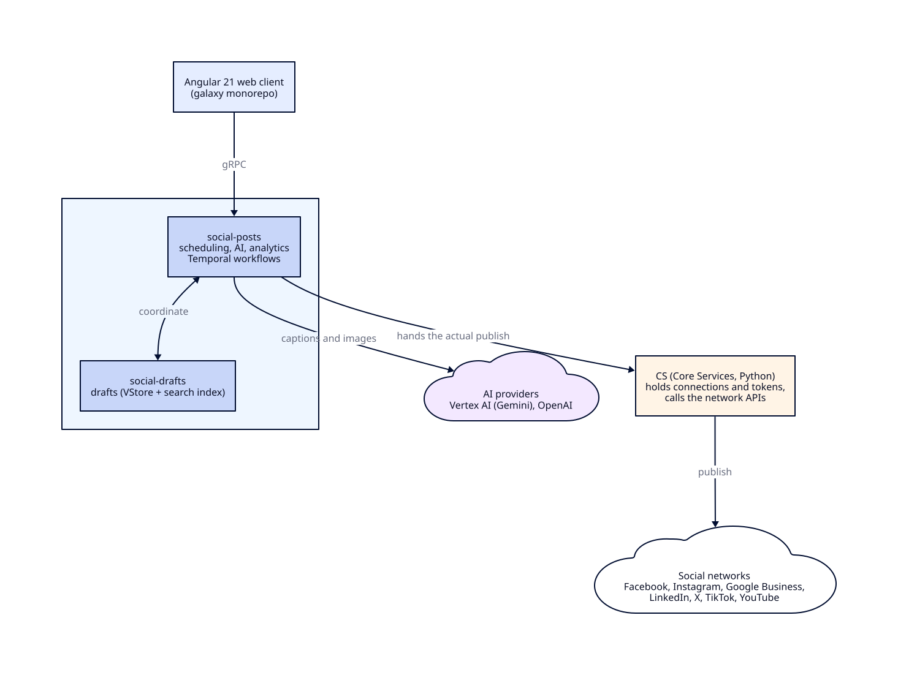

# Social Marketing / Social AI

## About the product

Social AI is a SaaS product that helps businesses manage their social media presence more efficiently by reducing repetitive and time-consuming tasks. It allows a business to connect all its social media accounts once and publish content across multiple platforms from a single dashboard. It supports Facebook Pages, Instagram, Google Business Profile, LinkedIn, X, TikTok, YouTube, as well as WordPress websites and blogs.

A business can schedule posts in advance using a content calendar or publish them immediately whenever required. It also provides the option to save unfinished posts as drafts and continue editing them later. When the team runs out of content ideas, the built-in AI can generate captions and create images and short videos based on a simple prompt. It can also fetch ready-to-use images and videos from stock libraries, recommend relevant hashtags, and reuse previously saved templates.

Once a post is published, the business can track its performance through analytics and generate on-brand AI replies for customer comments. For businesses operating multiple branches or locations, a single post can be published across all branches simultaneously, ensuring consistent communication.

Vendasta offers Social AI as a white-label solution, enabling agencies to resell the product under their own brand and provide social media management services to their local business clients.

## Questions that follow from this summary

Once the summary above is said out loud, the natural next questions are about how those capabilities actually work. Short, honest answers follow.

**When a business connects an account once, what happens behind that?**
The business authorises each network through its OAuth flow, and the connection is saved as a record tied to that business, called a social service. The access tokens for most networks are held server-side in the older Core Services system, while Instagram and X keep their own. The user never sees or handles a token, and a reconnection is only needed if a token later expires.

**How does publishing across many platforms from one dashboard actually work?**
One request starts a separate publishing job for each network, and each job runs as its own durable workflow. The networks are handled independently and in parallel, so a slow or failing one does not hold up the rest.

**If a post goes to five platforms and one fails, what happens to the other four?**
Because each network is its own workflow, four can succeed while one fails. The failed one retries within limits, and if it still cannot publish it falls back to a draft for that network, while the four successful posts stay live. It is never all-or-nothing.

**How does scheduling stay reliable if a server restarts before the post is due?**
Scheduling runs on durable Temporal workflows that sleep until the due time and survive restarts and deployments. It is not an in-memory timer that would be lost when a process restarts.

**How does the AI keep captions on-brand rather than generic?**
Before writing, it retrieves context about that specific business and adds it to the prompt, so the words reflect the business's own voice rather than a generic shop. The prompts themselves are kept centrally so they stay consistent across the product.

**Which AI models are used, and what about cost and limits?**
Captions use an OpenAI model, images use Google's Gemini model on Vertex AI with an OpenAI image model as a fallback, and short videos use Google's Veo model. Usage is metered, and image generation is rate-limited per business so a single account cannot run up unlimited cost.

**How does one post reach every branch of a multi-location business?**
A multi-location post fans out into one post per branch, and each targets that branch's own connected accounts. The posting service coordinates the fan-out so the message stays consistent everywhere.

**What does white-label mean here in practice?**
The same services serve many partners at once, scoped by partner and by business, and the branding is presented per partner by the platform, so an agency's client sees the agency's brand rather than Vendasta's while one backend serves everyone.

**Each network has different rules and rate limits. How is that handled?**
Each network has its own integration, and the network-specific API calls are made by the service that owns them, mostly Core Services. Bounded retries and error classification keep a network's temporary hiccup from turning into a duplicate post or a lost one.

**Where do the analytics come from?**
There are two things worth separating here. First, where the numbers come from: the raw figures, reach, impressions, likes, and comments, come from each network's own API, so the networks are the source of truth and we do not compute them ourselves. Second, what our side does: it pulls those numbers in and presents them per post, so the product is a collector and presenter of the networks' metrics, not the calculator of them. In the code, social-posts exposes a post-performance service with a stats read and a CSV export, and the per-network services fetch network-specific figures such as Instagram business stats and Google Business insights.

## A quick example

Consider Priya, who runs a small bakery on a busy street. She has a Facebook page, an Instagram account, and a Google Business listing, and she knows she should post on all of them regularly. Every week she means to share a photo of the day's fresh bread, announce a weekend offer, or reply to a customer's comment. By evening, after baking and billing and closing the shop, she is too tired to log into three apps and write three posts. So the pages go quiet, and quiet pages lose customers.

This is the everyday problem Social Marketing was built to solve. The product, now renamed Social AI, is Vendasta's way for a business like Priya's to manage all of its social media from one place. She writes a post once, and the product publishes it to every network at the same time. If she does not know what to write, the built-in AI drafts the caption for her and even generates the image. She can schedule a whole week of posts in one sitting, and later she can see how each one performed and reply to the comments it collected.

In short, Social AI takes the parts that make social media tiring, the switching between apps, the blank page, the forgetting, and the guesswork, and quietly handles them so that a busy owner can stay present online without spending her evenings on it.

## Who uses it, and how it is sold

To understand the product, it helps to know how it reaches a business like this in the first place. Vendasta does not sell to her directly. It builds the platform and sells it to partners, which are marketing agencies and media companies, and those partners resell it to their own local-business clients under their own brand.

So there are three layers of people in the story. There are the partners who pay Vendasta, the local businesses who are the partners' clients, and the everyday users who actually log in, usually the business owner or a marketer at the agency looking after many clients at once.

Inside the code, one business is called an account group, and its identifier travels with every post and every connected account. When a brand has many outlets, say a bakery chain with twenty branches, one post can be written once and sent out to every branch's own accounts together. That is the multi-location feature, and it matters a great deal to franchises.

## What it can do

At its heart, Social AI lets a business connect its accounts once and then post everywhere from a single screen. The networks it reaches are Facebook Pages, Instagram, Google Business Profile, LinkedIn for both companies and people, X which used to be Twitter, TikTok, and YouTube, along with WordPress and blogs. A connected account is stored as a record the product calls a social service, and each one carries its type, such as a Facebook page or an Instagram user.

Around that core sit the features that make the product pleasant to use. A business can schedule posts on a calendar or publish them at once. It can save unfinished work as a draft and return to it later.

When inspiration runs dry, the AI writes the caption and generates or edits the image or a short video from a short prompt, and if a stock photo is wanted instead, the product pulls images and short clips from libraries like Pexels, Pixabay, Unsplash, and Tenor. It suggests hashtags, keeps reusable templates, and groups posts into campaigns.

After a post goes out, it gathers performance figures and can even help draft on-brand replies to the comments that arrive.

## The journey of a single post

The clearest way to see the product is to follow one post from beginning to end.

{width=70%}

Priya begins by connecting her accounts, which she does once and rarely thinks about again. When she wants to announce a Saturday special, she opens the product on Thursday, asks it to write a caption, generates a photo of the special, chooses Facebook and Instagram and her Google listing, and sets it to go out on Friday evening. She then closes the app and forgets about it. On Friday evening the post appears on all three networks on its own. Over the weekend a few customers comment, and on Monday she checks how many people it reached. The quiet, reliable middle of that journey, the scheduling and the publishing, is the part I worked on most closely.

## What happens behind the scenes

Behind that simple experience sits a system midway through a long, deliberate change. The product began as a single Python application, and that monolith is being broken into smaller Go services with a new web interface, one piece at a time, with the old and the new kept in step.

{width=100%}

The web interface is a modern Angular application in the company's shared galaxy codebase, and it talks to the backend over gRPC through a generated software kit, so the app and the services always agree on the shape of the data. Requests land in a Go service called social-posts, the main coordinator: it owns the calendar, coordinates drafts, runs the AI copy and media features, handles multi-location fan-out, and gathers statistics.

The interesting part is how scheduling works, because it is not a simple timer. For each post, and for each network it is going to, social-posts starts a durable workflow on a system called Temporal. The workflow sleeps until the scheduled time, wakes, re-reads the post so any edit made in the meantime is picked up, and only then publishes.

Because the workflow is durable, a post scheduled a fortnight ahead survives restarts and deployments, and its retries and timeouts are handled for it. Editing a scheduled post stops the running workflow and starts a fresh one, and deleting it simply ends the workflow.

For the actual network call, social-posts usually does not make it directly. For Facebook, LinkedIn, X, and Google Business Profile it hands that step to an older service called CS, short for Core Services, which holds the connections and tokens and speaks to the networks. Instagram is the exception, with its own service and tokens, and can publish on its own. This reliance on CS is a piece of the older world the team is slowly unwinding.

## The services that share the work

social-posts does the coordinating, and a few other services share the work. A companion Go service, social-drafts, looks after drafts in the internal datastore with a search index alongside. The two work closely: if a scheduled post fails to publish, usually because a token expired, it is turned back into a draft rather than lost, so the user can reconnect and try again with the words and image intact.

Behind them sit the older parts. The original Python application, SM, still holds some data and once served the old web pages, and work is steadily moving out of it. CS remains the keeper of connections and posts to most networks. Around the edges are the network specialists: the Instagram service handles Instagram's sign-in, media, comments, and stats, the Facebook service handles lead forms, WhatsApp, and Messenger, and the Google Business service handles insights and questions and answers over a fast local copy of CS data.

An AI platform called ai-assistants holds the prompts and the defined abilities the AI features use.

## The technology, and why it was chosen

Each choice here has a reason worth giving.

**Why Go for the new services?**
Go is fast, simple, strong at handling many things at once, and it is the company standard. Moving off the single Python application let each piece deploy on its own and gave better performance on this product's traffic, which is a high number of calls carrying small payloads with a lot of fan-out reads.

**If Go is the preferred language, why is the system still part Python, and why not migrate everything?**
The product started as a Python monolith and Go is the target, but a full rewrite all at once would be risky and slow to deliver value. So we migrate one capability at a time with the strangler pattern, keeping the old and the new in step through events. The legacy Python, mainly Core Services, still owns working, proven integrations, connections, and tokens, and there is little value in rewriting something that works until its replacement is proven. The trade-off is a period of coexistence: two stacks, an events bridge, and a few concepts owned in both places. That is the deliberate cost of migrating safely rather than taking a big-bang outage, and the highest-value pieces move first.

**Why gRPC and Protocol Buffers?**
They give a shared, strongly-typed contract, generated client libraries, and lower latency than plain JSON over the older HTTP. For a public website meant for browsers, plain REST would still be the sensible choice, but here the traffic is internal and app-to-service, where gRPC fits well.

**Why Temporal for scheduling?**
A post may wait for days or weeks before it goes out, and it must survive restarts and crashes in between. Temporal provides durable execution, along with retries and timeouts, so the team did not have to build a fragile scheduler and a separate table of jobs by hand.

**Where does the data live, and how is it run?**
Data owned by a service sits in the company's internal datastore, with a search index added for drafts where searching matters. The Go services run on Kubernetes, and their health is watched through service-level objectives rather than raw alarms, so the on-call engineer is woken for real problems and not for noise.

**Which AI providers, and why not the inference gateway?**
Caption writing uses an OpenAI model, image generation uses Google's Gemini on Vertex AI with an OpenAI image model as a fallback, and video uses Google's Veo. These calls go to OpenAI and Vertex AI directly, or through the ai-assistants platform, and not through the inference-gateway. That inference-gateway is a separate side project of mine, and I keep the two distinct.

**Why use Vertex AI for Gemini rather than calling Google's model API directly?**
Vertex AI is Google's managed way to run Gemini inside GCP, the same cloud the rest of the product already lives in. That gives one identity and access model, one billing and quota setup, and data that stays inside the GCP trust boundary under enterprise terms, rather than a second credential and a separate provider relationship. For a white-label product handling many businesses' data, that governance and unified operation matter. The drawbacks are a thin extra layer and that Vertex can lag the provider's newest model by a little, but for an enterprise product the control is worth it.

## Where the intelligence comes from

The rename from Social Marketing to Social AI reflects real, working intelligence, not just a new name.

When Priya asks the product to write her caption, it does not simply send her request to a general model as it is. First it gathers context about her specific business, drawing on stored knowledge through a retrieval step, and adds that to the instructions before asking the model to write. The result is copy that sounds like her bakery rather than a generic shop. This retrieval-then-generate approach is what keeps the writing grounded.

For the image, she gives a short description and the product generates or edits a picture using the Gemini image model on Vertex AI. When a customer later leaves a comment, the product can read the comments on the post and draft a reply that stays on-brand and true to the business, a feature that today works for Instagram. All of these abilities are defined and their prompts are kept in the central ai-assistants platform, so they are consistent and versioned rather than scattered through the code. The product can also generate a short video from a prompt using Google's Veo model, the same grounded approach applied to motion.

## My part in the story

I work across both the Go services and the Angular interface, and the part I can speak to most deeply is the pipeline that handles posts and drafts.

I designed and built the Go services on Kubernetes that carry a post from scheduling through to publishing, with careful attention to deadlines and to bounded retries. The guiding idea was simple to state and hard to get right: a scheduled post should either publish exactly once or fail cleanly and fall back to a draft, and it should never be silently lost and never be posted twice.

Getting the failure behaviour right was the real work. When a network's API misbehaves, and the worst case is one that quietly accepts a post but then reports a timeout, the code recognises that situation and refuses to retry into a duplicate. Through a quarter in which failures from the networks roughly doubled, that discipline is what let us hold our availability target.

I also led the move of this functionality off the old Python application and onto the Go services that speak gRPC. Before choosing, I weighed gRPC against staying on REST for the shape of traffic we actually had, and gRPC won on latency for our many small fan-out calls, which brought the tail latency on the busy path down noticeably.

Alongside that, I rebuilt the build-and-deploy pipeline with multi-stage Docker images and tests that run in parallel, which cut deployment time sharply and removed the maintenance windows we used to schedule. I encouraged test-first development across the services and wrote the testing guide the team adopted, and I moved our alerting onto service-level objectives so that pages meant something again.

Along the way I took on technical-lead work, running design and code reviews across the services and guiding two engineers through their first on-call rotations and their first production incidents.

To be honest about the boundaries, the AI writing and image features were built alongside me by the team. I understand well how they fit together, the grounded caption pipeline, the Gemini image path, and the shared prompts, and I can walk through the architecture, but I lead with the posting, drafts, migration, and reliability work, because that is mine.

## A few real situations

The product is easiest to trust when you see it handle ordinary days.

On a good day, Priya asks for a caption about Friday's fish fry, generates an image, picks three networks, and schedules it for Thursday evening. Three quiet workflows sleep until Thursday and then post to each network, and she never thinks about the machinery.

On a busy day at an agency, a single marketer looks after fifty client businesses, moving between them and scheduling content for each, and using the multi-location feature to push one announcement out to every branch of a franchise at once.

On a bad day, a post fails because a Facebook token has expired. Instead of vanishing, the post turns itself back into a draft. Priya reconnects the account, submits again, and nothing is lost and nothing is duplicated. The bad days are where the careful design matters most.

## Senior-level questions on the product and my work

For a senior role, the questions move past what the product does and into how it is designed, where it breaks, why each decision was made, and how I lead the work. These are the ones I prepare for, grouped by theme.

**Design and scale**

**If you designed the scheduling and publishing system from scratch today, how would it look?**
The core shape would be the same: a durable workflow engine, Temporal, with one workflow per post per network, because the real requirements are long waits, surviving restarts, per-network independence, and handling edits and deletes mid-flight. I would fix the two legacy pieces: make the publish call idempotent at the boundary so a retry is always safe, and let each network's own service perform its publish instead of routing through the older Core Services. I would keep the read model separate from the write model, which the current v1 and v2 split already leans toward.

**How would this handle ten times the posts, and where does it break first?**
Temporal scales by adding workers, so the scheduling layer absorbs load horizontally. The first pressure points are the networks' own rate limits and Core Services as a shared publish hub. I would add per-tenant and per-network rate limiting and queueing so a burst from one partner does not starve the others, and I would remove the shared-hub bottleneck by moving publish into each network's service. After that, the draft search index and the stats queries are the next things I would review.

**How do you guarantee exactly-once publishing when a network can time out after it has already accepted the post?**
Honestly, across a boundary I do not control, the achievable target is effectively-once, not true exactly-once. Today we bound retries and classify the timed-out-but-already-posted errors as not worth retrying, so we do not retry into a duplicate. The proper fix is an idempotency key on each publish so a retry the network has already seen becomes a no-op, and that key belongs at the Core Services boundary. As a backstop, reconcile after the fact by checking whether the post actually landed before ever creating a second.

**Reliability and correctness**

**What happens to a workflow that keeps failing, a poison post?**
Retries are bounded, a fixed number of attempts with a per-activity timeout, so nothing retries forever. Once the bound is hit, the post falls back to a draft and surfaces to the user, and the failure shows up in metrics. A genuinely stuck workflow is visible in Temporal and can be terminated. The deliberate choice is to fail loudly to a draft rather than loop quietly.

**How do you keep data consistent between the old Python app and the new Go services during the migration?**
They are bridged with events rather than a shared database. The old app publishes changes on Pub/Sub topics and the Go services subscribe, so a draft changed in one place reaches the other. It is eventual consistency, which is the right call for a gradual migration, and it means the consumers must be idempotent and the design must allow for reconciliation. The end state is a single owner per concept so the bridge can be removed.

**How do you observe this in production, and how did you set the SLOs?**
Metrics on publish success and failure per network, on workflow durations, and on backlog, with alerting tied to service-level objectives rather than raw thresholds. That way we are paged on a user-visible symptom, such as the publish success rate falling below target, not on every transient blip. Moving our alerting onto SLOs is specifically what cut the false pages the on-call rotation used to get.

**The gRPC migration**

**You chose gRPC over REST. What did you measure, and when would you not choose it?**
I compared latency and payload overhead for our actual traffic, which is a high number of small calls with heavy fan-out reads. gRPC on HTTP/2 with protobuf won on tail latency and gave us generated, type-safe clients that keep the web app and the services in step, and it dropped p99 on the hot path. I would not choose it for a public, browser-facing, third-party API, where REST and JSON are easier to consume and debug; there I would keep REST or put a gateway in front.

**How did you migrate off the monolith without a risky big-bang cutover?**
The strangler pattern. Stand up the Go service, move one capability at a time, bridge the state with events during the overlap, and keep the old path alive until the new one is proven. Feature flags and running both paths in parallel let us shift traffic gradually and roll back a single capability without disturbing the rest.

**Quality and testing**

**How do you test a Temporal workflow that sleeps for days and calls external systems?**
Temporal's test framework runs a workflow with time skipped forward, so a two-week sleep completes instantly, and the activities are mocked so no real network call happens. That makes the scheduling logic, the edit-and-restart path, the delete path, and the retry and fallback behaviour deterministic to test. The activities that call external systems get their own unit tests with the client mocked, plus a small set of opt-in integration tests against the real API that are run by hand, never in the normal pipeline.

**You drove test-first development across the services. How do you get a team to actually adopt it?**
Make it the easy path rather than a lecture. I wrote the testing guide and set up the harness so adding a test is simple, made coverage visible in the pipeline, and reviewed for tests in every pull request until it became the norm. The argument that won the skeptics was the result: production bug volume from those services came down.

**Leadership and judgment**

**Tell me about a production incident you handled.**
The one that mattered was a quarter when failures from the social networks roughly doubled. Because failed publishes fell back to drafts and retries were bounded and duplicate-safe, users saw posts they could resubmit rather than lost or duplicated content, and we held the availability target. My part was the error-classification and fallback design that turned a bad quarter of provider flakiness into a survivable one, and guiding two engineers through their first incidents on that system.

**How do you run a design review, and what do you push on?**
I push on failure modes and ownership first: what happens when this call fails, times out, or is retried, and who owns the data. For this product that means asking about idempotency, deadlines, and the edit-or-delete-mid-flight cases before anyone talks through the happy path. I would rather spend the review on the three ways a design breaks than on the one way it works.

**The dependency on Core Services for publishing is a known wart. Why is it still there, and how would you remove it?**
It exists because Core Services already owns the connections, the tokens, and the working network integrations, so delegating to it was the safe and fast path during the migration. Removing it is real work: move token ownership and the network API calls into each network's own service, add an idempotent publish at that boundary, and cut over one network at a time behind flags. It is sequenced after the higher-value migration work, which is a deliberate choice about priorities, not an oversight.

**How would you add a new social network to the product?**
Model its connection as a new social-service type, add its OAuth and token handling, and implement a publish activity inside a network workflow that mirrors the existing ones: sleep until the time, re-read the post, publish, classify the errors, and fall back to a draft on failure. Then surface it in the web client through the generated SDK. The workflow scaffold is shared, so most of the effort is the network's own API quirks and its rate limits.

**How would you keep AI cost under control as usage grows?**
Rate-limit per business, which image generation already does, cache where prompts repeat, choose the smaller model when it is good enough, and track cost per generation as a first-class metric beside latency. The grounding step helps too, because a stronger first draft means fewer regenerations.

## Explaining it in two minutes

I work on Social AI, which was called Social Marketing until recently. It lets a local business manage all of its social media from one place. Instead of logging into Facebook, Instagram, Google, LinkedIn, and X separately, the business writes a post once, the AI can draft the caption and make the image, and the product schedules it and publishes it to every connected network at the same time. It also tracks how each post did and helps reply to comments.

Vendasta sells this to partner agencies, who resell it to their local-business clients under their own brand, so it is a white-label product inside a bigger platform.

Underneath, the product is moving from an older Python application to Go services that talk over gRPC, with a modern Angular interface. Scheduling runs on Temporal, so a post set for next week reliably goes out even across restarts and deployments.

My part is the backend pipeline for posts and drafts, the scheduling and publishing, and making it reliable when a network fails, so a post either publishes cleanly or drops back to a draft, never lost and never duplicated. I also led the move of these services from REST to gRPC and rebuilt the deployment pipeline.

## Explaining it in five minutes

Social AI is Vendasta's product for managing social media. The problem is simple. A local business, say a dentist or a bakery, has accounts on several networks and no time to post to each one by hand, so the pages go quiet. Social AI lets the business write and schedule a post once and publish it everywhere, with the AI helping write the words and make the image, and with figures afterwards that show what worked.

The way it is sold shapes the product. Vendasta sells the platform to partners, which are agencies and media companies, and they resell it under their own brand to local businesses. In the code, one business is an account group, and a chain with many branches can write one post and send it to every branch at once, which is the multi-location feature.

The main abilities are posting to Facebook, Instagram, Google Business Profile, LinkedIn, X, TikTok, and YouTube, scheduling on a calendar, saving drafts, generating captions, images, and short videos with AI, drafting replies to comments, and reporting on performance, along with templates and campaigns to keep things organised.

Underneath, the product is midway through a change. It began as a single Python application, and that is being broken into Go services with a new Angular interface. The two services I work on most are social-posts, which is the scheduling and coordinating brain, and social-drafts, which looks after drafts. The interface is a modern Angular app that talks to the backend over gRPC.

The most interesting part is scheduling and publishing. Scheduling runs on Temporal. Each post, for each network, becomes a durable workflow that sleeps until the chosen time, then reads the post again to catch any edits, then publishes. Temporal gives durability and retries for free, which matters because posts can be scheduled far in advance and must survive restarts.

For the actual network call, social-posts hands the work to an older service called CS, which holds the connections and tokens, except for Instagram, which has its own service.

Reliability is the theme I care about most. Retries are bounded, and errors that would cause a duplicate are recognised and not retried. If a post finally fails, usually because a token expired, it turns back into a draft so the owner can reconnect and try again.

My role spans the stack but leans to the backend. I own the posts-and-drafts pipeline, I led the move from REST to gRPC, I rebuilt the deployment pipeline with multi-stage Docker and parallel tests, and I moved our alerting onto service-level objectives. I also mentor two engineers and run design and code reviews.

## Explaining it in ten minutes

Let me tell it from the beginning: the product and the business, then how it works, then my part, then what I would change.

Social AI, once called Social Marketing, is Vendasta's product for managing social media. Vendasta sells to partners, agencies and media companies, who resell to local businesses under their own brand, so the product is white-label inside a larger platform. In the code, one business is an account group.

The problem is that a local business has a presence on many networks and neither the time nor the skill to keep them all active. Social AI answers that in three ways: it publishes everywhere from one place, it uses AI to solve the blank-page problem by drafting the caption and generating an image or a short video, and it shows what worked through a calendar and analytics.

The abilities are publishing to Facebook, Instagram, Google Business Profile, LinkedIn, X, TikTok, and YouTube plus WordPress and blogs, scheduling on a calendar, drafts, multi-location fan-out for franchises, AI captions, images and videos, comment replies, stock media, hashtags, templates, and performance reporting.

How it works is the interesting part, because it is a live migration. The product started as a Python monolith and is being broken into Go services with a modern Angular interface, carefully, with the old and the new kept in step. The frontend talks to the backend over gRPC through a generated kit.

The main backend service is social-posts, in Go. It owns the calendar, drafts, the AI features, multi-location fan-out, and stats. It does not ingest or usually publish directly: for Facebook, LinkedIn, X, and Google Business Profile it hands the publish to the older Core Services, which holds the connections and tokens, while Instagram is the exception with its own service. Alongside it, social-drafts owns drafts.

Scheduling is the piece I would highlight. It runs on Temporal, not a cron job. Each post, for each network, becomes a durable workflow that sleeps until the chosen time, re-reads the post to catch edits, then publishes. Temporal gives durability, retries, and the edit-and-delete cases for free, which matters because a post can be scheduled weeks ahead and must survive restarts.

Reliability is the theme I care about most. The hard case is a network that times out after it already accepted the post, because retrying would duplicate a public post. So we classify those errors and do not retry them, and the proper fix is an idempotent publish, which lives in CS. A post that genuinely fails, usually an expired token, is turned back into a draft. The principle is to publish cleanly or fail cleanly, never lose and never duplicate. Through a quarter when provider failures roughly doubled, that handling held our availability target.

On the AI side, which is why the product was renamed, captions use an OpenAI model with a retrieval step that grounds the copy in the specific business, images use Google's Gemini on Vertex AI, and video uses Google's Veo. Comment replies work today for Instagram, and the prompts live centrally in the ai-assistants platform. These calls go to OpenAI and Vertex AI, or through ai-assistants, not through the inference-gateway, which is a separate side project of mine.

My role spans the stack but leans to the Go backend. I own the posts-and-drafts pipeline, the Temporal scheduling and publishing, the bounded retries and deadlines, and the draft fallback on failure. I led the move off the Python monolith onto gRPC, rebuilt the deployment pipeline with multi-stage Docker and parallel tests, drove test-first development, and moved alerting onto service-level objectives. I also work on the Angular frontend and run reviews and mentoring.

If asked what I would improve, I would free the networks from CS so each is owned by its own service with an idempotent publish, and finish the move off the monolith so each concept has one home. Both turn a working migration into a clean one.

## The short version

Social AI, once Social Marketing, is Vendasta's product for managing social media from one place. Agencies resell it to local businesses, one business being an account group. A business posts once and reaches Facebook, Instagram, Google Business Profile, LinkedIn, X, TikTok, and YouTube. The interface is a modern Angular app; the backend is Go services, chiefly social-posts for scheduling and social-drafts for drafts, moving off an older Python application. Scheduling runs on Temporal, one durable workflow per post per network. An older service called CS holds the connections and publishes to most networks, while Instagram runs its own. Reliability comes from bounded retries, recognising duplicate-causing errors, and turning a failed post back into a draft. The AI writes grounded captions, generates images with Gemini on Vertex AI and short videos with Veo, and drafts Instagram comment replies. My part is the posts-and-drafts pipeline, the move from REST to gRPC, the deployment pipeline, test-first practice, service-level alerting, frontend work, and technical-lead duties.
