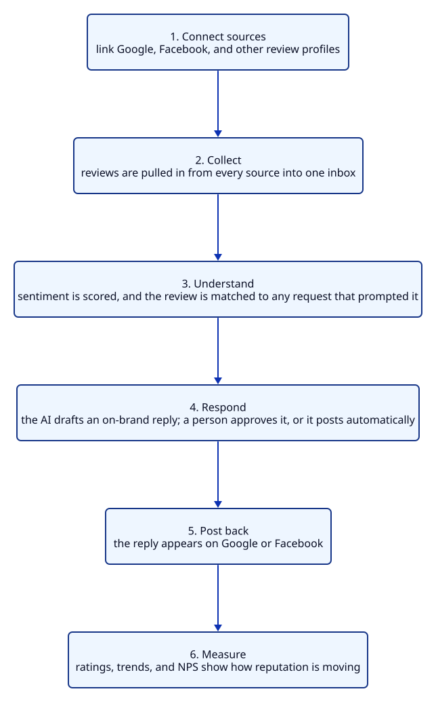
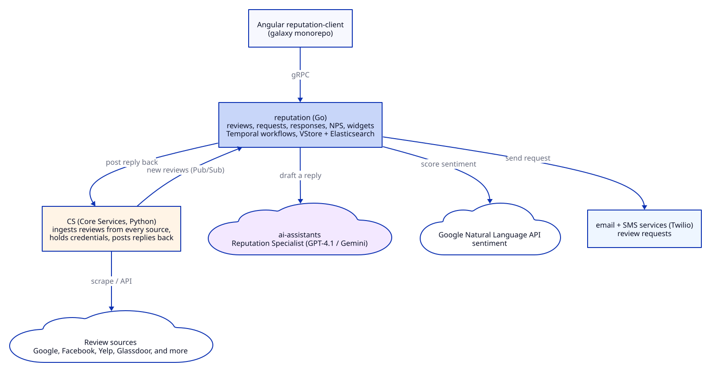

# Reputation Management / Reputation AI

## About the product

Reputation AI is a SaaS product that helps businesses monitor and improve their online reputation across the sites where customers talk about them. It pulls a business's reviews from every source into one dashboard, so the owner no longer has to check Google, Facebook, and a dozen other sites one by one. It covers Google Business Profile, Facebook, Yelp, and a long list of other review sites and industry directories.

From that one place, a business can respond to a review, and the built-in AI drafts an on-brand reply it can post back to Google or Facebook. It can save replies as drafts for a person to approve, or let the AI post them automatically once it is trusted. Response templates keep the tone consistent, and a concierge option lets a human write replies on the business's behalf.

Reputation AI also helps a business earn more reviews. It sends review requests to customers over SMS and email, tracks which request led to which review, and measures satisfaction with Net Promoter Score surveys and on-site review widgets. Sentiment analysis scores every review so trends and common complaints surface on their own.

The AI Reputation Specialist connects all of this. It drafts and can auto-post replies, and it answers plain-language questions about a business's reviews and scores.

Vendasta offers Reputation AI as a white-label solution, so agencies resell it under their own brand and provide reputation services to their local-business clients.

## Questions that follow from this summary

Once the summary above is said out loud, the natural next questions are about how those capabilities actually work. Short, honest answers follow.

**When a business connects a review source, what happens behind that?**
For Google and Facebook, the business authorises the source through its OAuth flow, and the connection and token are held server-side in the older Core Services system. For sources without a usable public API, there is nothing to connect; the reviews are collected by scraping instead. The product knows a fixed set of source types by ID and treats Google and Facebook as the two where a reply can be posted back.

**How are the reviews actually collected?**
Reviews are not pulled by the modern service directly. Core Services runs the ingestion: it pulls or scrapes reviews from more than twenty sites, stores them, and publishes each new review onto a message topic. The Go reputation service subscribes to that topic to score sentiment, match the review to any request that prompted it, and re-emit an event for the rest of the platform.

**How does the AI draft an on-brand reply?**
The reputation service asks the AI Reputation Specialist, running on the ai-assistants platform, to generate a response. The prompt maps tone to the star rating and includes the review text, the reviewer, the business name, and the rating, so the reply fits the situation rather than being generic.

**Can it post replies automatically, and is that safe?**
Yes, but it is gated and cautious. Auto-response is turned on per account behind a feature flag. The workflow either posts the reply as a public comment or saves it as a draft for a person to approve, and if posting fails it falls back to a draft. The default posture leans on human approval until a business trusts it.

**Which sources can you actually respond on?**
Only Google and Facebook support first-party owner responses, and Vendasta's own review widget always allows a reply. A couple of industry sources allow responses for allow-listed partners. For the rest, such as Yelp, the product shows the review but there is no path to post a reply back.

**How do review requests work, and how do you avoid spamming customers?**
A business picks contacts and sends a request. A durable workflow tries SMS first and falls back to email per contact. SMS is metered, with a free monthly allowance on the Premium tier, and SMS sending is downgraded to email when carrier registration checks are not met. Each request is recorded and later matched to the review it produced.

**What is the sentiment analysis based on?**
It uses Google's Natural Language API, not a chat model. It returns an entity-level sentiment score and magnitude per review, which the product caches and shows as trends and word clouds. It is classical language processing, so I would call it AI only in the broad sense.

**Which models power the AI features, and does it use your inference gateway?**
The AI responses run through the ai-assistants platform, which uses OpenAI and Google models, with GPT-4.1 as the recommended default. It does not go through the inference-gateway. That gateway is a separate side project of mine, and I keep the two distinct.

**Where does the review data live?**
The reviews themselves are owned by Core Services and read back from there, so the reputation service does not keep its own copy. The reputation service owns the newer entities in VStore: review requests, response drafts, review widgets, NPS scores, and feature limits, with Elasticsearch for search and filtering.

**What does white-label mean here in practice?**
The same services serve many partners at once, scoped by partner and by business, and the branding is presented per partner by the platform, so an agency's client sees the agency's brand. The product is gated by an IAM application called RM, and access is checked per business, which the code calls an account group.

## Senior-level questions on the product and my work

For a senior role, the questions move past what the product does and into how it is designed, where it breaks, and how I would evolve it. These are the ones I prepare for, grouped by theme.

**Design and scale**

**If you designed review ingestion and response from scratch today, how would it look?**
I would keep the split that already exists: an ingestion layer that normalises reviews from every source and publishes them on a topic, and a product service that consumes them. The two things I would fix are the legacy coupling and the fragility. Ingestion and owner-response posting both sit in the old Core Services monolith, so I would move each source's fetch and post behind its own service with an idempotent post-back, and I would treat scraping as a last-resort fallback rather than a core path.

**How would this handle ten times the reviews, and where does it break first?**
The consuming side scales on workers and Temporal, so that absorbs load. The first pressure points are the external sources' rate limits and Core Services as a shared ingestion-and-post hub. Scraping is the most fragile part under load, so I would add per-source rate limiting and backoff, lean on push notifications and APIs over scraping wherever a source offers them, and watch Elasticsearch query load as review-request volume grows.

**How do you avoid posting a duplicate reply to a review?**
The same effectively-once problem as any external post. A network can accept the comment and then time out, and a blind retry would double-post a public reply, which is worse than a duplicate social post because it is visibly wrong. The durable fix is an idempotency key on the post-back at the Core Services boundary. I would also reconcile by checking whether the reply already landed before posting a second.

**Reliability and correctness**

**How do you stop the AI from posting a bad public reply?**
Several guards. Auto-posting is off by default and gated per account. The prompt maps tone to the star rating so a one-star review does not get a cheerful reply. The workflow defaults to saving a draft for human approval, and only posts automatically when a business has opted in. If a post fails, it falls back to a draft rather than retrying blindly. The safe default is a human in the loop.

**How is a review matched back to the request that prompted it?**
When a request is sent, it is recorded, and when a review arrives, a Temporal workflow matches the incoming review against the pending request records for that business and logs the attribution and a CRM activity. It is a best-effort match on timing and contact, not a hard key, because the review site does not tell us which request produced the review.

**How do you keep data consistent between the legacy apps and the Go service during the migration?**
They are bridged with events rather than a shared database. Core Services publishes reviews on a topic and the Go service consumes them, and historical data from the old system is backfilled into the new model in one-off jobs. It is eventual consistency, which suits a gradual migration and means the consumers must be idempotent. There is a known overlap where the older Customer Voice module and the newer service both handle review requests, and resolving which one is authoritative is part of finishing the migration.

**The gRPC and migration story**

**Why gRPC, and how is the migration being done without a big-bang cutover?**
gRPC gives a shared, typed contract and generated clients, which is why the Angular app talks to the reputation service through a generated SDK. The migration is the strangler pattern: the original Python monolith still runs and still owns ingestion and some legacy screens, while the Go service has peeled off reviews, requests, drafts, sentiment, NPS, and widgets one piece at a time, with events keeping the two in step.

**Quality and testing**

**How do you test the Temporal workflows for review requests and auto-response?**
Temporal's test framework runs a workflow with time skipped forward and the activities mocked, so the SMS-then-email fallback, the post-or-draft decision, and the fallback-to-draft path are all deterministic to test without sending a real message or posting a real reply. The activities that call the sms, email, ai-assistants, and Core Services clients get their own unit tests with those clients mocked.

**Leadership and judgment**

**How would you add a new review source?**
If the source has an API, add its fetch to the ingestion layer and its owner-response client so replies can post back, then register its source type and surface it in the frontend. If it has no API, it becomes a scrape-only source: reviews come in, but there is no post-back path, and the product marks it read-only. Most of the effort is the source's own quirks and rate limits.

**What would you improve?**
Two things. First, move ingestion and owner-response posting out of the Core Services monolith into per-source services with idempotent posting, so the fragile scraping and the shared hub stop being single points of failure. Second, finish the migration off the legacy apps, including resolving the Customer Voice and reputation-service overlap on review requests, so each concept has one owner.

Note to self: tailor the specifics and any numbers here to my own tickets. I have framed this from the architecture and my general strengths, so I should ground each claim in work I can speak to directly.

## The story

Consider Sana, who runs a busy dental clinic. Most new patients find her by searching online and reading her reviews before they ever call. A steady stream of good reviews brings in patients, and one angry review left unanswered for a week can quietly cost her business.

Sana does not have time to watch Google, Facebook, and the health-directory sites every day, and writing a calm reply to an upset patient at the end of a long shift is hard. So reviews pile up unanswered, and she has no easy way to ask her happy patients to leave one.

This is the everyday problem Reputation AI was built to solve. It brings every review into one place, drafts a professional reply she can approve in a tap, and makes it easy to ask satisfied patients for a review over a text message.

## Who uses it, and how it is sold

Reputation AI reaches Sana the same way Vendasta's other products do. Vendasta does not sell to her directly. It builds the platform and sells it to partners, which are agencies and media companies, and those partners resell it to their own local-business clients under their own brand.

So there are three layers of people in the story. There are the partners who pay Vendasta, the local businesses who are the partners' clients, and the everyday users who log in, usually the owner or a marketer at the agency looking after many clients at once.

Inside the code, one business is an account group, and access is gated by an application called RM. Response templates follow the same layering: Vendasta sets a default, and a partner, a market, or the business itself can override it.

## What it can do

At its heart, Reputation AI collects a business's reviews from every source into one inbox. It covers Google Business Profile, Facebook, Yelp, and a long list of other review sites, apartment and health directories, and industry-specific sites. Google and Facebook are the two where the business can also post a reply back.

Responding is the next piece. A business can reply to any review from the dashboard, lean on saved templates for a consistent tone, and let the AI draft the reply. On Google and Facebook the reply posts back to the source. A concierge option lets a Vendasta-side person write replies on the business's behalf.

Then there is earning reviews rather than just managing them. A business sends review requests to its customers over SMS and email, and each request is tracked and later matched to the review it produced. Net Promoter Score surveys and on-site review widgets add more ways to gather feedback.

The AI features add the rest. Sentiment analysis scores every review so trends and common complaints surface on their own, and the AI Reputation Specialist drafts replies, can post them automatically once trusted, and answers plain-language questions about a business's reviews and scores. Brand and competitor monitoring, Google questions and answers, and listing details are also part of it.

## The journey of a review

The clearest way to see the product is to follow one review from arrival to answer.

{width=70%}

A patient leaves Sana a four-star review on Google. Within a couple of hours it appears in her Reputation AI inbox, already scored for sentiment and matched to the request that prompted it. The Reputation Specialist drafts a warm, specific reply. Sana reads it, changes a word, and approves it, and it posts back to Google under her clinic's name. The rating and the trend update on her dashboard, and the whole thing took her under a minute.

## What happens behind the scenes

The backend is midway through a migration, the same shape as Vendasta's other products: it began as a Python application and is being broken into a Go service with a modern web interface, with the old and new running side by side.

{width=100%}

The frontend is a modern Angular application in the company's shared galaxy codebase, and it talks to the backend over gRPC through a generated software kit. Requests land in a Go service called reputation, which owns reviews, review requests, response drafts, NPS, and widgets.

Reviews are ingested by Core Services, not by the reputation service. Core Services pulls or scrapes reviews from more than twenty sites and publishes each new one on a message topic. The reputation service subscribes to that topic, scores sentiment with Google's Natural Language API, matches the review to any pending request, and re-emits an event for the rest of the platform.

Responding runs the other way. A reply, whether a person wrote it or the AI drafted it, is handed to Core Services, which holds the Google and Facebook credentials and posts it back to the source. Only Google and Facebook support this, so other sources are read-only in the product.

To draft a reply, the reputation service calls the ai-assistants platform, which runs the Reputation Specialist. Review requests go out through the separate email and SMS services over Twilio.

## The services that share the work

The reputation service does the coordinating, and several others share the work. Core Services is the ingestion and posting hub: it scrapes and pulls reviews and holds the credentials that post replies back to Google and Facebook. The ai-assistants platform runs the Reputation Specialist and serves the drafted replies. The email and SMS services deliver review requests.

Behind these are the older parts of the stack. The original Python monolith, called SR or steprep, is still live: it serves the concierge review-response product, holds the Facebook connection status the new frontend still checks, and carries legacy reporting. Customer Voice, a module in the same steprep project, handles a review-request flow that overlaps with the newer service, an overlap the migration still has to resolve. A newer Go service, customer-voice-service, holds the contact and customer data.

For storage, the reputation service keeps its own entities, the review requests, response drafts, widgets, NPS scores, and limits, in VStore, with Elasticsearch for search and filtering. The reviews themselves stay in Core Services, and the reputation service reads them back rather than copying them.

## The technology, and why it was chosen

Each choice was made for a reason worth being able to explain.

**Why Go for the reputation service?**
Go is fast, strong at concurrency, and the company standard. Moving off the Python monolith lets each piece deploy on its own and gives better performance.

**If Go is the preferred language, why is the system still part Python, and why not migrate everything?**
The product started as a Python monolith, SR, and Go is the target, but a full rewrite all at once would be risky and slow to deliver value. So we migrate one capability at a time with the strangler pattern, keeping the old and the new in step through events. The legacy Python, mainly Core Services and SR, still owns working, proven review ingestion, connections, and tokens, and there is little value in rewriting something that works until its replacement is proven. The trade-off is a period of coexistence: two stacks, an events bridge, and a few concepts owned in both places, such as the review-request overlap between Customer Voice and the reputation service. That is the deliberate cost of migrating safely, and the highest-value pieces move first.

**Why gRPC and Protocol Buffers?**
They give a shared, typed contract and generated clients, so the Angular app and the service always agree on the data.

**Why Temporal?**
A review request tries SMS and then email, an auto-response workflow drafts and posts a reply, and a matching workflow ties reviews back to requests. Temporal gives durable execution with retries and timeouts, so these survive restarts and crashes without a hand-built job table.

**Where does the data live, and how is it run?**
Data owned by the service lives in VStore, which sits on Cloud Spanner, with Elasticsearch for search and BigQuery for analytics. The service runs on Kubernetes, and its health is watched through service-level objectives rather than raw alarms.

**Which AI providers, and why not the inference gateway?**
The AI responses run through the ai-assistants platform, which uses OpenAI and Google models, with GPT-4.1 as the recommended default, and sentiment uses Google's Natural Language API. These calls go to those platforms directly, not through the inference-gateway, which is a separate side project of mine.

**Why route the AI through the ai-assistants platform, and why Vertex AI for Google's models?**
Two layers of the same idea. Going through the ai-assistants platform means the reputation service does not hard-wire a model or a prompt: the assistant, its personality, its abilities, and its model choice are managed centrally and shared across products, so the reputation service just asks for a response. Where Google models are used, Vertex AI runs them inside GCP, so identity, billing, quotas, and data residency are unified and the data stays inside the trust boundary under enterprise terms. The drawback is an extra layer and a little lag behind the newest models, but for an enterprise, white-label product the governance and reuse are worth it.

## Where the intelligence comes from

The rename from Reputation Management to Reputation AI reflects real, working intelligence, not just a new name.

The main piece is the Reputation Specialist, an AI Employee defined on the ai-assistants platform. It has a defined personality and a set of abilities: respond to reviews automatically, write review responses across many channels, and answer questions about a business's reviews and NPS.

When Sana gets a new review, the specialist drafts a reply whose tone matches the star rating, grounded in the review text and her clinic's details. Depending on her settings, the reply posts to Google automatically or waits as a draft for her to approve, and a failed post always falls back to a draft.

Sana can also just ask. The "chat with your reputation data" ability lets her ask plain-language questions, and the assistant answers by searching her reviews and NPS scores through defined tools rather than guessing. Sentiment scoring runs in the background, using Google's Natural Language API to turn every review into a score she can track over time.

## My part in the story

I work across the Go reputation service and the Angular frontend, and the part I can speak to most deeply is the backend that handles review requests and responses.

I work on the Go services on Kubernetes that carry a review request from the dashboard to the customer, and a reply from the dashboard back to the review site, both built on durable Temporal workflows. The guiding idea is the same one I care about everywhere: an action either completes exactly once or fails cleanly and falls back to a safe state, and it never silently loses work or does something twice. For a public review reply, that matters even more than for a social post, because a duplicate is visible to everyone.

That is why the auto-response flow leans on drafts and human approval by default, and falls back to a draft when a post fails, rather than retrying into a duplicate public comment.

I also work on the migration of this functionality off the legacy Python monolith and onto the Go service that speaks gRPC, and on the reliability of the Temporal workflows behind requests, matching, and responses. Alongside that I contribute to the Angular reputation-client frontend, and I take on the usual senior work of design and code reviews and helping other engineers.

To be honest about the boundaries, the AI drafting and the Core Services ingestion are owned elsewhere, by the ai-assistants platform and the legacy ingestion pipeline. I understand how they connect and can walk through the architecture, but I lead with the reputation-service backend and the reliability work, because that is mine. The specific metrics are best drawn from my own tickets rather than stated in general.

## A few real situations

A few ordinary situations show how it works.

A patient leaves a glowing five-star review. Sana has turned on auto-response for high ratings, so the specialist posts a warm thank-you on its own, and she never has to touch it.

An upset patient leaves a one-star review. The tone-aware draft is calm and takes the conversation offline, but because it is a low rating the reply waits as a draft for Sana to read and approve before it goes public.

Sana wants more reviews after a good week. She sends a review request to fifty recent patients. Each gets a text first, and anyone without a mobile number gets an email instead. As the reviews come in, each is matched back to the request that prompted it.

An agency manages reputation for eighty clients. One marketer watches every client's reviews and NPS from one place, and lets the specialist draft the routine replies so the team can focus on the hard ones.

## Explaining it in two minutes

I work on Reputation AI, which was called Reputation Management until recently. It helps a local business manage its online reputation from one place. Instead of checking Google, Facebook, and a dozen review sites separately, the business sees every review in one inbox, and the built-in AI drafts a reply it can approve and post back to Google or Facebook.

It also helps a business earn reviews. It sends review requests to customers over text and email, tracks which request led to which review, and measures satisfaction with NPS surveys and sentiment scoring.

Vendasta sells this to partner agencies, who resell it under their own brand to local businesses, so it is a white-label product inside a bigger platform.

Underneath, it is moving from an older Python system to a Go service that talks over gRPC, with a modern Angular interface. Reviews are ingested by the older Core Services and published on a topic that the Go service consumes, and both review requests and responses run on Temporal so they are reliable across restarts.

My part is the backend that handles review requests and responses, the Temporal workflows behind them, and making them reliable, so a reply posts once or safely falls back to a draft, never lost and never doubled.

## Explaining it in five minutes

Reputation AI is Vendasta's product for online reputation. The problem is simple. A local business, say a dental clinic, depends heavily on its reviews, but no owner has time to watch every review site or to write calm replies at the end of a long day, and few have an easy way to ask happy customers for a review.

Reputation AI brings every review into one inbox, drafts a reply the owner can approve and post back to Google or Facebook, and makes it easy to request reviews over text and email.

The way it is sold shapes the product. Vendasta sells the platform to partner agencies, and they resell it under their own brand to local businesses. In the code, one business is an account group.

The main abilities are monitoring reviews across Google, Facebook, Yelp, and many other sites, responding to reviews with templates and AI drafts, requesting reviews over SMS and email, sentiment analysis, NPS surveys, review widgets, and an AI Reputation Specialist that drafts replies and answers questions about the data.

Underneath, the product is midway through a change. It began as a Python monolith and is being broken into a Go service, called reputation, with a modern Angular interface. The reviews are ingested by an older service, Core Services, which scrapes or pulls them from more than twenty sites and publishes each new one on a topic. The reputation service consumes that topic, scores sentiment, and matches the review to any request that prompted it.

Responding runs back through Core Services, which holds the Google and Facebook credentials and posts the reply to the source. The AI drafting runs on a shared ai-assistants platform, and review requests go out through the email and SMS services over Twilio.

Reliability is the theme I care about most. Requests and responses run on Temporal, so they survive restarts. The auto-response flow defaults to drafts and human approval, and a failed post falls back to a draft rather than risking a duplicate public reply.

My role spans the stack but leans to the Go backend. I work on the review-request and response pipeline, the Temporal workflows, and the migration off the monolith, and I contribute to the Angular frontend and the usual senior review and mentoring work.

## Explaining it in ten minutes

Let me tell it from the beginning: the product and the business, then how it works, then my part, then what I would change.

Reputation AI, once called Reputation Management, is Vendasta's product for online reputation. Vendasta sells to partner agencies, who resell to local businesses under their own brand, so the product is white-label inside a larger platform. In the code, one business is an account group, gated by an application called RM.

The problem is that a local business is judged online by its reviews, and keeping up is more than a busy owner can manage. Reviews are spread across many sites, replying well takes time and care, and asking happy customers for reviews is easy to forget. Reputation AI answers all three: it gathers every review into one inbox, drafts replies the owner can approve, and makes requesting reviews a couple of taps.

The abilities are monitoring reviews across more than twenty sources, responding with templates and AI drafts and posting back to Google and Facebook, a concierge option where a person writes replies for the business, requesting reviews over SMS and email, sentiment analysis, NPS surveys, review widgets, brand and competitor monitoring, and Google questions and answers.

How it works is the interesting part, because it is a live migration. The product started as a Python monolith, SR or steprep, and is being broken into a Go service with a modern Angular interface, with the old and new kept in step. The frontend talks to the backend over gRPC through a generated kit.

The main backend service is reputation, in Go. It owns reviews, review requests, response drafts, NPS, and widgets, but it does not ingest the reviews itself. Core Services scrapes or pulls reviews from every source and publishes each new one on a topic. The reputation service consumes that topic, scores sentiment with Google's Natural Language API, matches the review to any pending request, and re-emits an event. The reviews stay in Core Services and are read back; the reputation service's own data lives in VStore with Elasticsearch for search.

Responding runs the other way, back through Core Services, which holds the Google and Facebook credentials and posts the reply to the source. Only Google and Facebook support owner responses, plus Vendasta's own widget, so other sources are read-only.

Review requests run on Temporal. A durable workflow tries SMS first and falls back to email per contact, sending through the SMS and email services over Twilio, and each request is matched to the review it later produces.

The AI is why the product was renamed. The Reputation Specialist, an AI Employee on the ai-assistants platform, drafts a reply whose tone matches the star rating, grounded in the review and the business's details. Depending on the settings, it posts automatically or waits as a draft, and a failed post always falls back to a draft. The business can also chat with its reputation data, asking questions the assistant answers by searching reviews and NPS. The models run through ai-assistants, GPT-4.1 by default, not through the inference-gateway, which is a separate side project of mine.

My role leans to the Go backend. I work on the review-request and response pipeline, the Temporal workflows behind requests, matching, and auto-response, and the reliability that makes a reply post once or fall back to a draft rather than double-post in public. I work on the migration off the monolith and contribute to the Angular frontend, and I take on design and code reviews and mentoring. The AI drafting and the legacy ingestion are owned elsewhere; I lead with the backend and reliability work, and I draw specific metrics from my own tickets.

If asked what I would improve, I would move ingestion and owner-response posting out of the Core Services monolith into per-source services with an idempotent post-back, and finish the migration off the legacy apps, including the Customer Voice and reputation-service overlap on review requests. Both turn a working migration into a clean one.

## The short version

Reputation AI, once Reputation Management, is Vendasta's product for online reputation. Agencies resell it to local businesses, one business being an account group. It gathers reviews from Google, Facebook, Yelp, and many other sites into one inbox, lets a business respond with templates and AI drafts and post back to Google and Facebook, and helps earn reviews through SMS and email requests, NPS surveys, and widgets. The interface is a modern Angular app; the backend is the Go reputation service, migrating off the legacy Python monolith SR. Reviews are ingested and posted back by the older Core Services and flow to reputation over a Pub/Sub topic. Review requests and responses run on Temporal. Sentiment uses Google's Natural Language API, and the Reputation Specialist AI Employee, running on the ai-assistants platform with GPT-4.1 by default, drafts replies, can auto-post with a draft fallback, and answers questions about the data. My part is the review-request and response backend, the Temporal workflows, the reliability, the migration, and frontend and technical-lead work.
